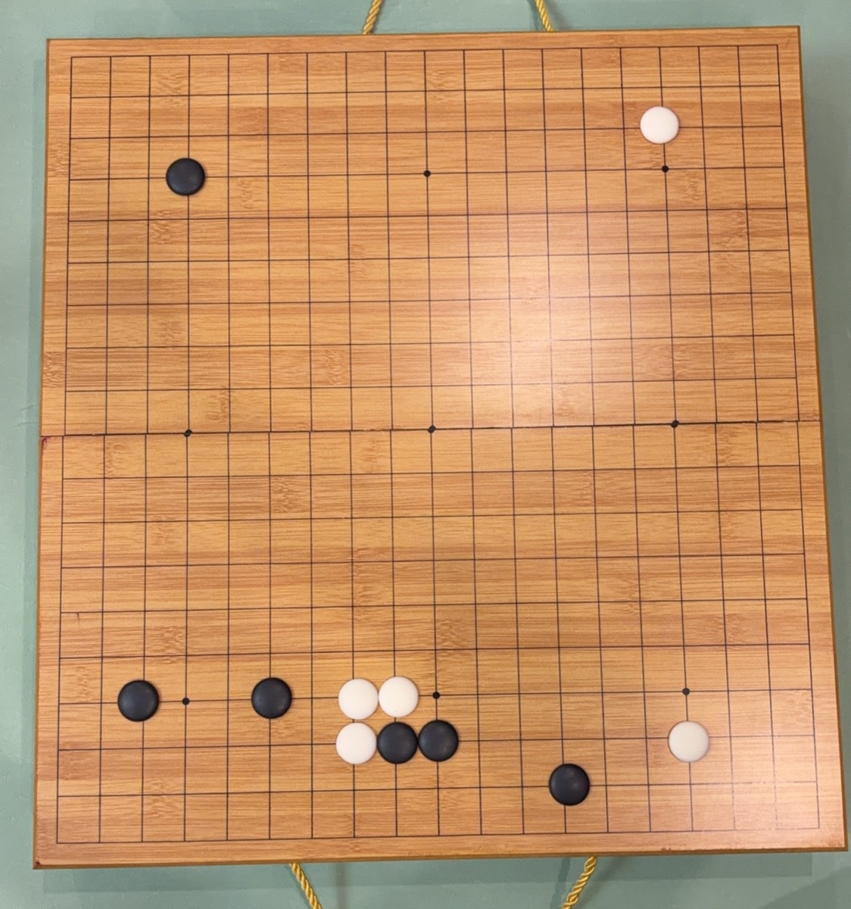
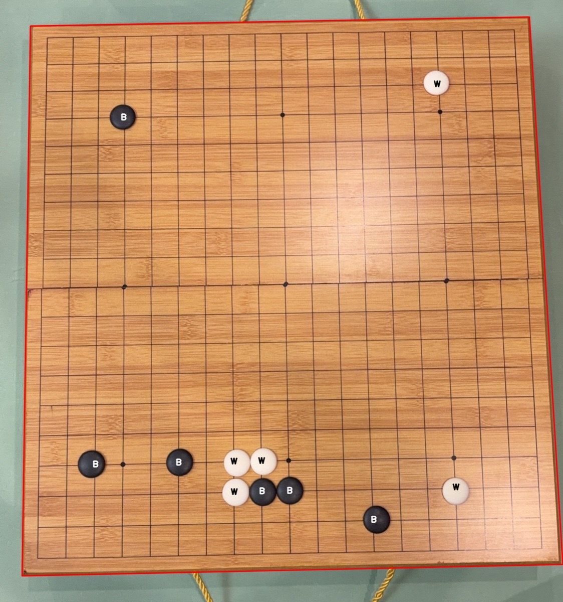
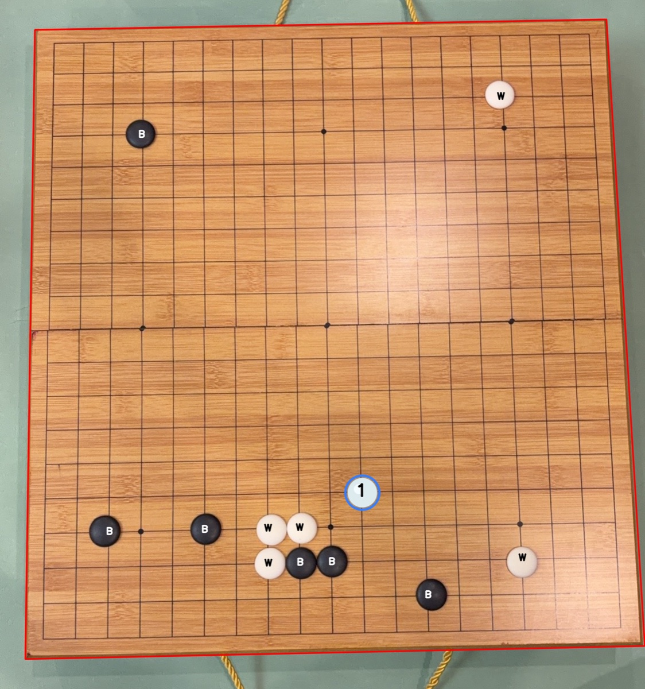
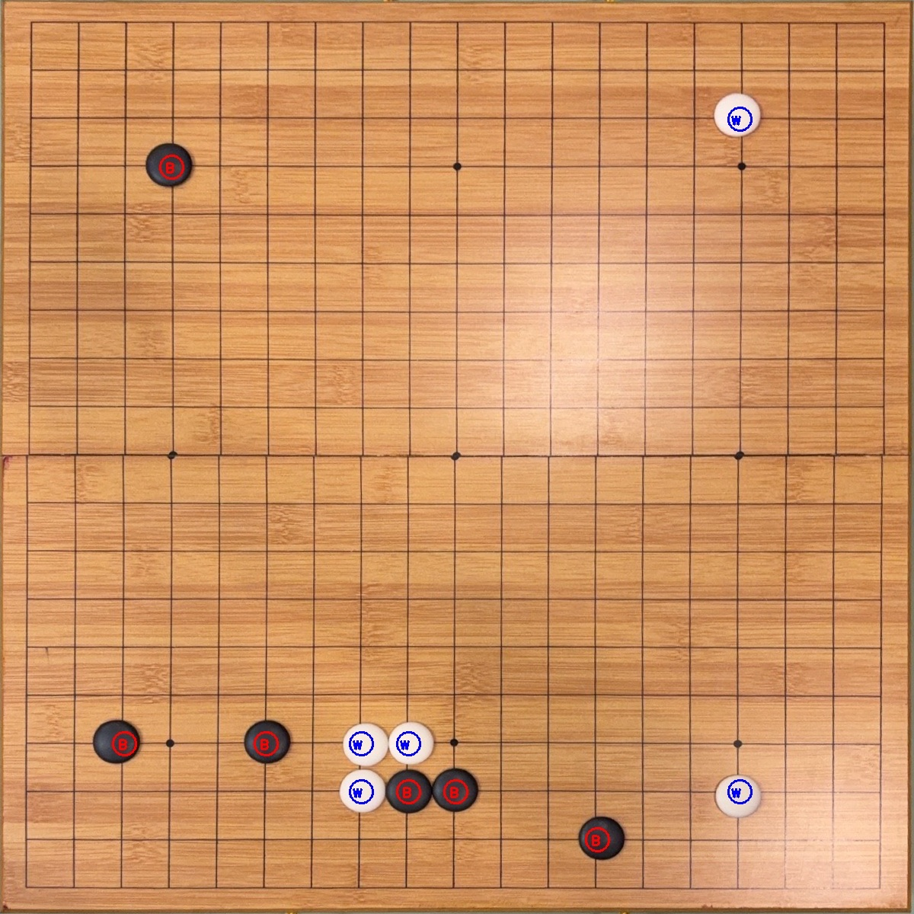
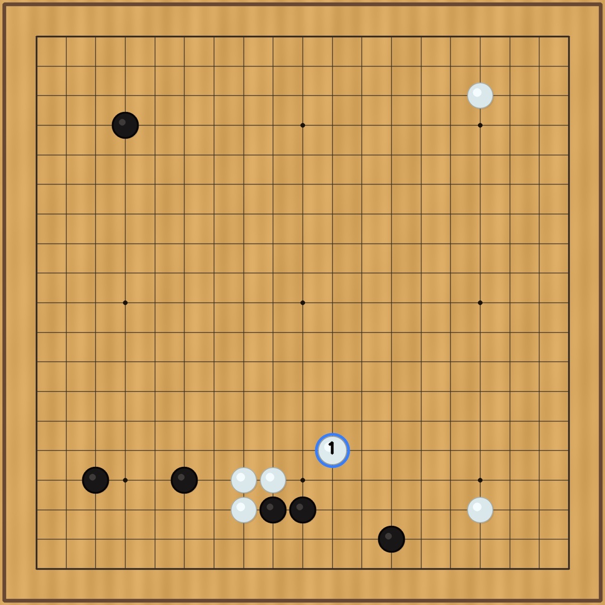

# 围棋下一手推荐 Skill

[English README](README.en.md)

这是一个用于围棋 / Weiqi 的下一手推荐工具。它可以从棋盘图片或文本棋盘中识别当前局面，调用本地 KataGo 分析候选点，并按指定的**落子强度级别**选择下一手。

这里的 `初级`、`中级`、`高级` 指的是推荐手的强度，不是解释的深浅。这样可以在不同水平的对局里，让 AI 给出更适合对手水平的下一手，帮助对局更接近势均力敌。

## 功能

- 将 19 路围棋棋盘图片识别成 `board_ascii` 二维棋盘。
- 支持直接输入已有的 `board_ascii` 文本棋盘。
- 使用本地 KataGo 进行下一手分析。
- 输出 JSON，包含当前级别推荐手、三档级别推荐、候选手和根节点评估。
- 可选生成识别校验图，方便人工检查棋子识别是否准确。
- 支持在不重新拍照的情况下追加“AI 推荐”和“人工录入”的无提子落子历史，并在结果图上连续编号。

## 环境要求

- Python 3.10+
- 本地已安装 KataGo
- KataGo 模型文件
- Python 依赖：

```bash
python3 -m pip install -r scripts/requirements.txt
```

本项目首先在 macOS + Homebrew KataGo 下测试：

```bash
brew install katago
katago version
```

脚本默认使用 Homebrew 自带模型路径：

```text
/opt/homebrew/share/katago/g170e-b20c256x2-s5303129600-d1228401921.bin.gz
```

如果你的模型在其他位置，运行时传入：

```bash
--model /path/to/model.bin.gz
```

## 图片输入

示例输入：



```bash
python3 scripts/next_move.py /path/to/board.jpg \
  --input image \
  --side-to-move black \
  --level intermediate \
  --visits 400 \
  --overlay /tmp/go-next-overlay.jpg \
  --source-overlay /tmp/go-source-overlay.jpg \
  --source-result-image /tmp/go-source-result.jpg \
  --result-image /tmp/go-next-result.jpg
```

`--source-overlay` 会在原照片上标出识别到的棋子和棋盘边界，适合给用户检查识别是否正确。对照片输入来说，工具默认也会生成一张合并后的原图结果：已有白子用黑色 `W` 标记，已有黑子用白色 `B` 标记；新推荐落点会画出对应颜色的新棋子，并在新棋子上写序号 `1`。如果你还想要干净棋盘图，可以显式传 `--result-image`；`--overlay` 是透视矫正后的棋盘裁切图，主要用于调试。

示例输出：

| 识别校验图 | 原图推荐结果 |
| --- | --- |
|  |  |

| 透视矫正后的识别校验 | 干净棋盘结果图 |
| --- | --- |
|  |  |

上面的示例来自 `./docs/examples/input-board.jpg`。在该局面中以白棋行棋、`--level all --visits 80` 运行时，示例结果推荐白棋走 `L5`。实际推荐会随模型、访问数和配置略有变化。

## 无提子连续推理

如果拍照后没有发生提子，可以把后续已确认落子作为 overlay 追加进去。原始图片识别状态会保留在 `base_board_ascii`，追加落子保存在 `move_overlays`，实际送入 KataGo 的合成局面保存在 `board_ascii`。

参数格式：

```text
--move-overlay source:color:move:label
```

- `source`：`ai` 或 `user`
- `color`：`B` / `black` / `黑`，或 `W` / `white` / `白`
- `move`：GTP 坐标，例如 `Q4`
- `label`：图片上显示的手数序号

示例：白棋第一手是 AI 推荐，黑棋第二手是人工录入，然后继续推白棋第三手：

```bash
python3 scripts/next_move.py /path/to/board.jpg \
  --input image \
  --side-to-move white \
  --move-overlay ai:W:Q4:1 \
  --move-overlay user:B:D16:2 \
  --source-result-image /tmp/go-step-3.jpg
```

脚本会检查这些追加落点在合成过程中必须为空；如果目标点已有棋子，说明坐标、识别或局面状态不一致。发生提子时不要用追加历史，重新拍照重置棋盘，只推理一步。

如果自动识别棋盘不准，可以手动传四个棋盘角点：

```bash
python3 scripts/next_move.py /path/to/board.jpg \
  --input image \
  --side-to-move white \
  --corners "74,76 1100,53 1118,1031 72,1034"
```

如果传入的是四个最外侧网格交叉点，而不是木质棋盘边角，再加：

```bash
--grid-corners
```

## 文本棋盘输入

`board_ascii` 每行表示棋盘一行：

```text
...................
...................
...................
...X...............
...................
...................
...................
...................
...................
...................
...................
...................
...................
...................
...................
...............O...
...................
...................
...................
```

字符含义：

- `X` 或 `B`：黑棋
- `O` 或 `W`：白棋
- `.`：空点

运行：

```bash
python3 scripts/next_move.py board_ascii.txt \
  --input ascii \
  --side-to-move black \
  --level beginner \
  --result-image /tmp/go-next-result.jpg
```

也可以从 stdin 输入：

```bash
cat board_ascii.txt | python3 scripts/next_move.py \
  --input ascii \
  --side-to-move white \
  --level all
```

## 落子强度级别

- `beginner` / `初级`：选择一个能下但刻意更温和的 KataGo 候选手。
- `intermediate` / `中级`：选择一个接近最优的稳健候选手，但不总是第一推荐。
- `advanced` / `高级`：选择 KataGo 搜索排序第一的最强候选手。
- `all` / `全部`：同时返回三档级别推荐，方便比较。

当前分级策略使用候选手排序、相对最强手的目数损失和胜率损失来选择。这是第一版实用策略，不是严格校准过的段位模型。

## 输出

脚本输出 JSON。重要字段：

- `recommendation`：按 `--level` 选出的推荐手
- `base_board_ascii`：原始图片或文本输入识别出的棋盘，不包含拍照后的追加落子
- `move_overlays`：已确认的拍照后落子历史，例如 AI 推荐和人工录入
- `display_move_overlays`：用于结果图绘制的落子序号，包含已确认历史和本次新推荐
- `reason.summary`：一句话推荐结论
- `reason.explanation`：为什么这么走，包含强度选择、搜索访问数、胜率/目差、主变化和候选手取舍
- `reason.technical_parameters`：技术参数，包含根节点评估、推荐手评估、搜索第一候选、胜率、目差、访问数、prior、LCB、PV 等
- `reason.comparison_candidates`：前几个替代候选手，以及相对推荐手/搜索第一候选的损失
- `recommendations_by_level`：初级、中级、高级三档推荐
- `candidate_moves`：KataGo 候选手，包含 visits、winrate、score lead 和 PV
- `root_info`：KataGo 根节点评估
- `board_ascii`：实际送入 KataGo 的棋盘
- `recognition`：图片识别元数据，仅图片输入时存在
- `result_image`：带推荐落点标记的结果图路径，仅在你显式传入 `--result-image` 时存在
- `source_result_image`：照片输入时默认生成的原照片合并图路径，已有棋子用 B/W 文字标记，推荐落点用带序号 `1` 的新棋子标记
- `recognition.source_overlay`：原照片识别校验图路径，仅传入 `--source-overlay` 时存在

输出形状示例：

```json
{
  "requested_level": "intermediate",
  "recommendation": {
    "move": "Q4",
    "strength_level": "intermediate",
    "score_loss_vs_best": 0.8,
    "winrate_loss_vs_best": 0.03
  },
  "reason": {
    "summary": "建议白棋走 Q4。这是按中级强度选择的近似最优候选手。主变化参考：Q4 -> D16 -> C17。",
    "explanation": [
      "选择依据：中级强度：优先选择接近最优、但不一定是第一推荐的稳健候选手。",
      "局面评估：胜率 54.2%，预估目差 +1.6。"
    ],
    "main_variation": ["Q4", "D16", "C17"],
    "technical_parameters": {
      "engine": "KataGo",
      "rules": "Chinese",
      "recommended_move": {
        "move": "Q4",
        "visits": 138,
        "winrate_percent": "54.2%",
        "score_lead_points": "+1.6",
        "score_loss_vs_best": 0.8
      }
    }
  },
  "recommendations_by_level": {
    "beginner": {},
    "intermediate": {},
    "advanced": {}
  }
}
```

## 只做棋盘识别

如果只想把图片转成二维棋盘：

```bash
python3 scripts/go_board_recognition.py /path/to/board.jpg \
  --source-overlay /tmp/go-source-overlay.jpg
```

识别校验图会标出棋盘边界和识别到的黑白棋，效果可参考上面的 `识别校验图`。

## 注意

- 单张棋盘图片通常无法判断轮到谁下，所以必须传 `--side-to-move`。
- 图片模糊、倾斜、裁切、有覆盖标记时，识别可能出错。重要局面建议检查 `--overlay` 输出。
- `--move-overlay` 只适合无提子连续推理；有提子、打劫或任何局面不一致时，重新拍照重置。
- 白棋识别不只看亮度，还会检查中心低饱和和中心/外环对比，以减少亮木纹或反光空点被误判成白子的情况。
- 如果想要最强推荐，用 `--level advanced`，并适当增大 `--visits`。

## License

本项目使用 [Creative Commons Attribution-NonCommercial 4.0 International](LICENSE) 许可。你可以复制、分享、修改和再发布，但需要保留署名，且不能用于商业用途。
